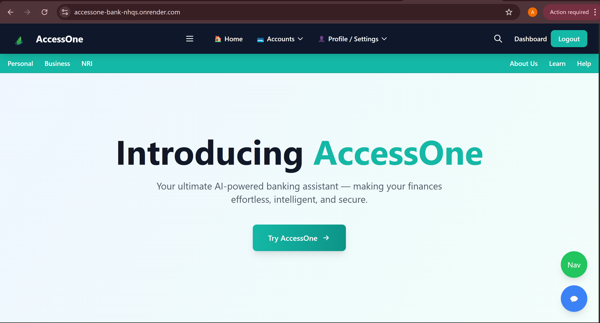
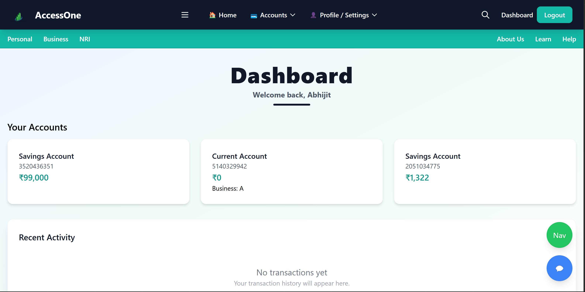
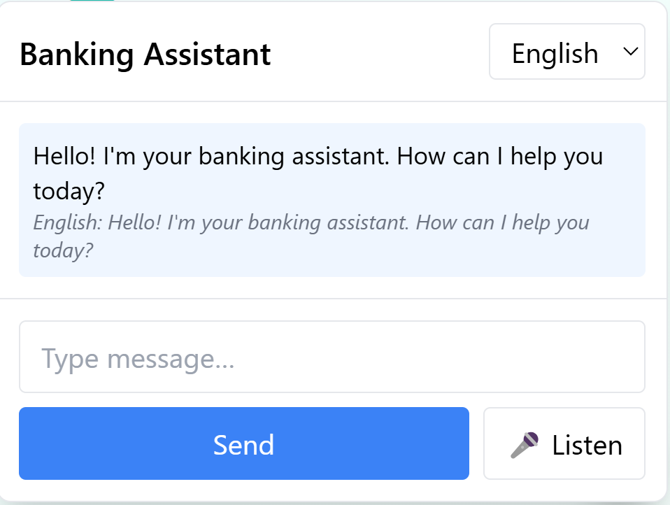
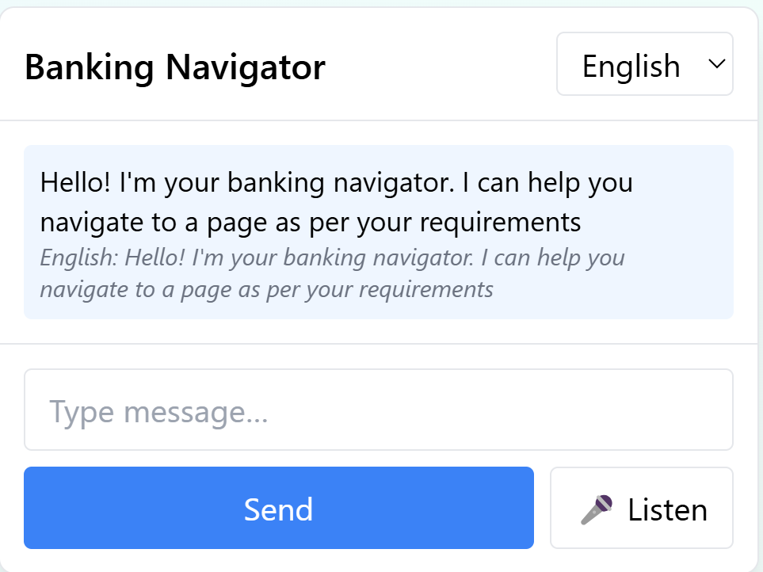
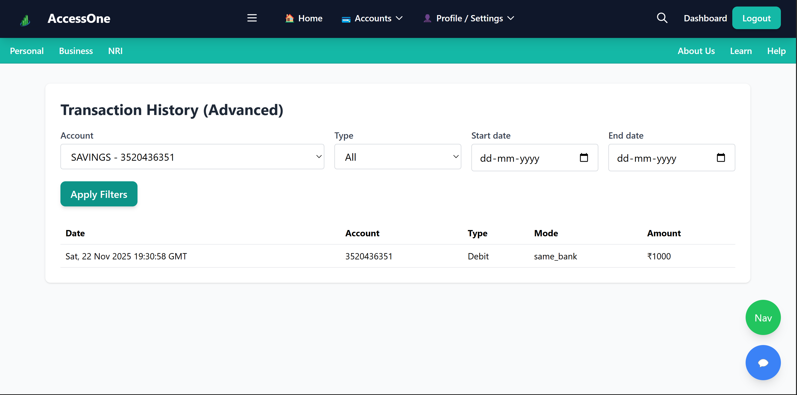

# AccessOne - AI Banking Copilot 🤖🏦

**A Multilingual Conversational + Navigation Assistant for Digital Banking**

---

## 📌 Problem & Need

Modern digital banking offers hundreds of features, but the user experience (UX) creates barriers. Users often face:

* **🕵️‍♂️ Discovery Issues:** "Where do I update my KYC?" or "How do I increase my limit?"
* **🕸️ Complex Menus:** Nested options (e.g., *Home → More → Profile → Services*) discourage exploration.
* **🗣️ Language Barriers:** Most apps are English-first, alienating users who speak Hindi, Bengali, Tamil, etc.
* **📞 Support Overload:** Users resort to customer care for simple tasks they couldn't find in the app.

---

## 💡 Our Solution: The AI Banking Copilot

**AccessOne** is not just a chatbot; it is a **Navigator**. It integrates directly into the banking web app to act as a digital relationship manager.

### 1. Conversational AI Chatbot 💬
A multilingual, context-aware bot that understands banking queries in **English, Hindi, and (soon) Bengali**. It explains concepts like FD vs. RD, credit scores, and more.

### 2. Smart Bank Navigator 🧭
The AI takes action. It doesn't just tell you *how* to do it; it takes you there.
> **User:** "I want to transfer money."
> **System:** Automatically navigates to *Yonopay → Transfer money*.

### 3. Voice-Enabled Interaction 🎙️
Supports **Speech-to-Text** and **Text-to-Speech**, allowing users to operate the entire banking app using only their voice.

---

## 📸 Application Screenshots

### The Intelligent Dashboard
*A clean overview of accounts, balances, and recent activities.*

  

 

### AI Assistant & Navigator
*The conversational assistant explaining concepts and guiding navigation.*

  
  

 

### Advanced Transaction Filtering
*Filter, search, and manage transaction history with ease.*

  

---

## 🚀 Key Features

| Feature | Description |
| :--- | :--- |
| **🧠 Context Awareness** | Remembers previous queries (e.g., "Show me credit cards" -> "Show me ones with no fee"). |
| **🗺️ Intent Mapping** | Maps user intent ("Open savings account for sister") to exact page routes. |
| **🗣️ Multilingual Voice** | Full voice command support in English and Hindi. |
| **🔒 Secure Banking** | Handles standard banking features like Transfers, Statement Downloads, and Account Overviews. |

---

## 🛠️ Technology Stack

A production-grade stack ensuring speed, scalability, and robustness.

### Backend & AI
* **FastAPI:** High-performance backend service.
* **Gemini API:** LLM for Natural Language Understanding.
* **LangChain:** Orchestration of prompts and tools.
* **ChromaDB:** Vector database for memory and knowledge retrieval.

### Frontend
* **React.js:** Interactive banking UI.
* **Web Speech API:** For native Speech-to-Text and Text-to-Speech processing.

---

## 🏗️ System Architecture

1.  **Presentation Layer:** Browser UI captures Voice/Text input.
2.  **Application Layer (FastAPI):** Receives input, detects intent, and routes to the AI engine.
3.  **AI Layer (Gemini + LangChain):**
    * Processes the query against **ChromaDB** (Banking Knowledge).
    * Determines if the user needs an *Explanation* or a *Navigation Action*.
4.  **Integration Layer:** Executes the logic and updates the UI state (e.g., redirects page).

**Example Workflow:**
> *"Mujhe debit card block karna hai"* (Hindi)
> 1. Voice captured ➡️ Transcribed to text.
> 2. Backend detects intent: `BLOCK_CARD`.
> 3. Navigator finds route: `/cards/manage/block`.
> 4. Frontend redirects user to the Block Card page.
> 5. AI responds audibly: "Opening the card management section for you."

---

## 🛡️ Security & Scalability

* **Data Privacy:** No sensitive PII (Personally Identifiable Information) is sent to the LLM. Data is masked before processing.
* **Authentication:** Session-based access control (OAuth/JWT compatible).
* **Scalability:**
    * **Async FastAPI:** Handles thousands of concurrent connections.
    * **Vector Search:** Optimized embedding retrieval for low latency.

---

## 🌍 Real-World Use Cases

1.  **👴 Elderly Users:** "Balance batao" (Voice command) → App speaks balance and shows screen.
2.  **🆕 New User Onboarding:** "What can I do here?" → AI tours the features.
3.  **♿ Accessibility:** Visually impaired users can navigate purely via audio.
4.  **📉 Customer Support Deflection:** Solves "How do I..." questions instantly, reducing call center load.

---

## **Created by Team Pixel**

1. **Abhijit Mohanty** [LinkedIn](https://www.linkedin.com/in/abhijit-mohanty-476722253/) | [GitHub](https://github.com/abhijitmohanty782)
2. **Arijit Pal** [LinkedIn](https://www.linkedin.com/in/arijit-pal-op/) | [GitHub](https://github.com/griffinArijit)
3. **Raunak Sarkar** [LinkedIn](http://www.linkedin.com/in/raunak-sarkar-424a4425b) | [GitHub](https://github.com/Raunak-Sarkar)
4. **Pasagadugula Swathi Siva Durga** [LinkedIn](https://www.linkedin.com/in/swathi-pasagadugula-9b4a70265/) | [GitHub](https://github.com/swath28)

